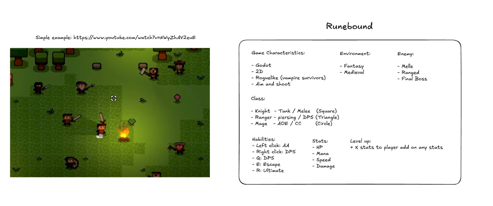

# Runebound

## Description

Simple game created using Godot Engine.
Will be set in a mediavel fantasy world with three heros to play. Each hero will have it own pros/cons to diferentiate each one of them from the rest.
Only three types of enemies will be created to simplify the creation of the game.

## Reference

---

## Characteristics

- Godot Engine
- 2D
- Roguelike (Vampire Survivors)
- Aim and Shoot

## Environment/Game Set

- Fantasy
- Medieval

## Classes

- Knight (Square)
    - Tank
    - Melee
    - Stats
        - High HP
        - Low Mana
        - Medium Speed
        - Medium Damage

- Archer (Triangle)
    - Piercing
    - DPS
    - Stats
        - Medium HP
        - Low Mana
        - High Speed
        - Medium Damage

- Mage (Circle)
    - AoE
    - CC
    - DPS
    - Stats
        - Low HP
        - High Mana
        - Low Speed
        - High Damage

# Hability Controls

- Left Click:   Auto-Attack
- Right Click:  DPS
- Q:            DPS
- E:            Escape
- R:            Ultimate

## Enemy

- Melee
- Ranged
- Boss (Final)

## Creators

  
  <a href="https://github.com/marcosewbank">marcosewbank</a>

  
  <a href="https://github.com/proudynyu">proudynyu</a>

