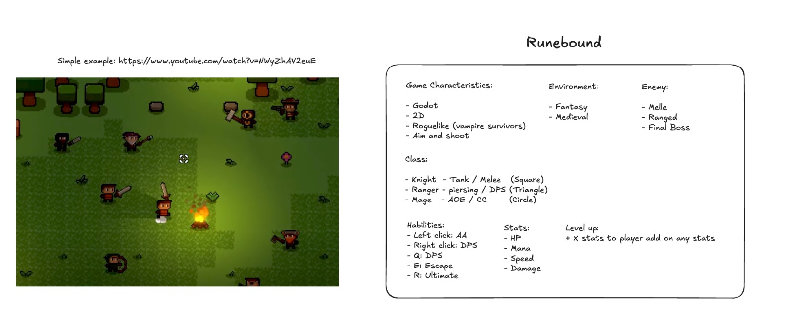

# Runebound

A 2D medieval fantasy game built with **Godot 4.4**.

**Design target:** ARPG + defendable base (day gather / night defend, weapon loadouts). See [docs/design.md](docs/design.md).  
**Technical docs (current code):** [docs/README.md](docs/README.md).

## Current Playable Build

The main scene (`scenes/main/main.tscn`) still implements a **survivor-style** arena loop: move with WASD, auto sword attacks, collect XP, pick upgrades on level-up, survive escalating waves (orcs join at difficulty 6), last up to 5 minutes for victory. The base-defense pivot in `docs/design.md` is not implemented yet.

## Description (Design Vision)

MVP direction (see [docs/design.md](docs/design.md)): roguelite ARPG + base defense — weapons staff / axe / dagger (swap at Hearth; staff fires effect projectiles), fixed base with four doors (one active spawn door per run), day gather / night defend, achievements as meta. Build order: [docs/implementation.md](docs/implementation.md).

## Reference

Full MVP design (map, weapons, phases, economy): **[docs/design.md](docs/design.md)**.

## Creators

  
  <a href="https://github.com/marcosewbank">marcosewbank</a>

  
  <a href="https://github.com/proudynyu">proudynyu</a>

