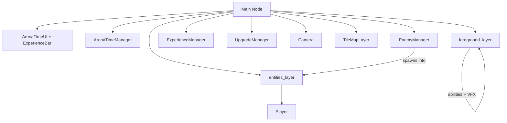
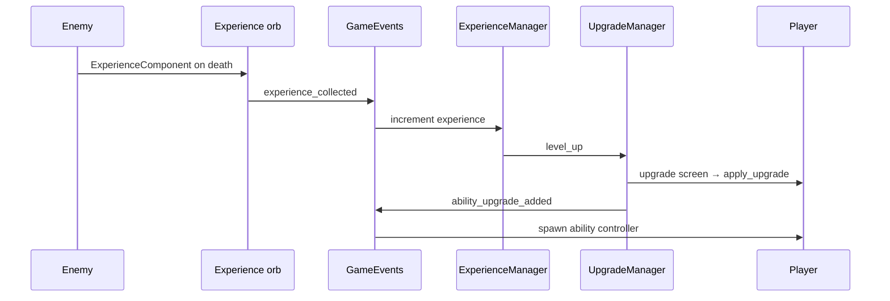

# Architecture

Runebound follows a **component + manager** pattern common in Godot survivor-likes: gameplay entities are `CharacterBody2D` scenes composed of child components, while singleton-style managers in the main scene orchestrate spawning, progression, and run timing.

## High-Level Scene Graph

The main scene (`scenes/main/main.tscn`) wires together UI, managers, world layers, and the player.



### Layer Groups

Two `Node2D` groups partition the world for spawning and rendering:

| Group | Purpose |
|-------|---------|
| `entities_layer` | Player, enemies, experience orbs |
| `foreground_layer` | Ability instances, floating damage text |

Managers and abilities resolve these via `get_tree().get_first_node_in_group(...)`.

### Player Group

The player node is in the `player` group. Enemies use `VelocityComponent` to chase it; ability controllers query it for targeting and positioning.

## Autoload

| Name | Path | Role |
|------|------|------|
| `GameEvents` | `scenes/autoload/game_events.tscn` | Global signal bus for experience collection and upgrade application |

`GameEvents` decouples collectors and managers from direct references:

```gdscript
signal experience_collected(experience_amount: float)
signal ability_upgrade_added(upgrade: AbilityUpgrade, current_upgrades: Dictionary)
```

## Managers

All managers live as children of `Main` and are configured through scene exports.

### EnemyManager

- Spawns enemies on a repeating timer at a random point on a circle around the player (`SPAWN_RADIUS = 360`).
- Uses `WeightedTable` to pick enemy scenes (basic slime by default; orc added at arena difficulty 6).
- Listens to `arena_difficulty_increased` to shorten spawn interval and expand the enemy pool.

### ExperienceManager

- Tracks `current_experience`, `current_level`, and `target_experience`.
- Subscribes to `GameEvents.experience_collected`.
- Emits `experience_updated` (for the HUD) and `level_up` (for `UpgradeManager`).

### UpgradeManager

- Holds an `upgrade_pool` of `AbilityUpgrade` resources.
- On level-up, instantiates `upgrade_screen.tscn`, offers two random choices, and calls `apply_upgrade`.
- Tracks `current_upgrades` by upgrade `id` and removes maxed-out entries from the pool.
- Emits upgrades through `GameEvents.emit_ability_upgrade_added`.

### ArenaTimeManager

- Runs a **300-second** (5-minute) one-shot timer.
- Every **5 seconds** of elapsed time, increments `arena_difficulty` and emits `arena_difficulty_increased`.
- On timer timeout, shows the end screen (same scene as defeat, defaulting to victory labels in the `.tscn`).

## Physics Layers

Configured in `project.godot`:

| Layer | Name | Typical use |
|-------|------|-------------|
| 1 | Terrain | Tilemap collision |
| 2 | Player | Player body |
| 3 | Enemy | Enemy bodies |
| 4 | EnemyCollision | Hitboxes and player-enemy overlap areas |
| 5 | PlayerPickup | Experience orb collection |

Gravity is disabled (`2d/default_gravity = 0`) for top-down movement.

## Display

- Internal resolution: **640×360**, stretched to **1280×720** (viewport stretch).
- Pixel-art filtering: `default_texture_filter = 0` (nearest).

## Camera

`scenes/game_object/camera/camera.gd` extends `Camera2D`:

- Follows the player with exponential smoothing.
- Applies a mouse-offset look-ahead (clamped) so the view shifts slightly toward the cursor.

## Planned vs Implemented

The root README describes a three-hero medieval fantasy game with aim-and-shoot combat. The **current main scene** uses a simplified survivor loop:

| Area | Status |
|------|--------|
| Single player (`player.tscn`) | **Active** — WASD movement, contact damage, sword + upgradeable abilities |
| Knight / Ranger / Mage scenes | **Scaffolded** — `BaseCharacter` stats exist; scenes not wired into `main.tscn` |
| Weapon bases (`BaseWeapon`, `MeleeBaseWeapon`, `RangedBaseWeapon`, `wand.gd`) | **Partial** — mouse-aim shooting logic exists but is not used by the main player |
| Basic enemy (slime) | **Active** |
| Orc enemy | **Active** — joins spawns at difficulty 6 |
| Ranged enemy, boss | **Not implemented** |
| Death particles (`death_component.tscn`) | **Scene only** — not attached to enemies |
| Victory condition | **Not wired** — `end_screen.gd` only exposes `set_defeat()`; arena timeout uses default victory labels |

## Event Flow Overview


