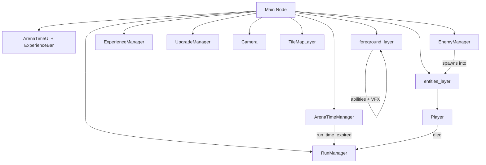
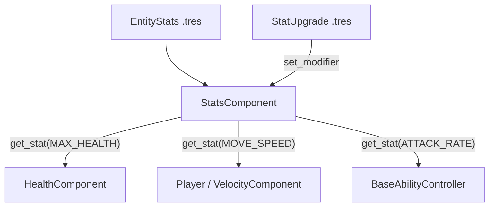
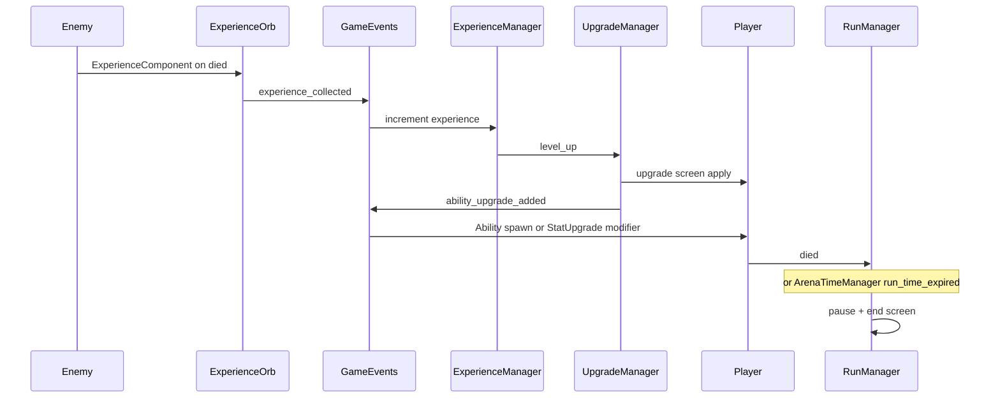

# Architecture

Runebound follows a **component + manager + data** pattern: gameplay entities are `CharacterBody2D` scenes composed of child components, stats come from `EntityStats` resources, and managers in the main scene orchestrate spawning, progression, and run timing.

## High-Level Scene Graph

The main scene (`scenes/main/main.tscn`) wires together UI, managers, world layers, and the player.



### Layer Groups

Two `Node2D` groups partition the world for spawning and rendering. Constants live in `scripts/constants/groups.gd` (`Groups.PLAYER`, `Groups.ENEMY`, etc.).

| Group | Purpose |
|-------|---------|
| `entities_layer` | Player, enemies, experience orbs |
| `foreground_layer` | Ability instances, floating damage text |

The player node is in the `player` group. Enemy **bodies** are in the `enemy` group (used by targeting).

## Autoload

| Name | Path | Role |
|------|------|------|
| `GameEvents` | `scenes/autoload/game_events.tscn` | Global signal bus for experience collection and upgrade application |

```gdscript
signal experience_collected(experience_amount: float)
signal ability_upgrade_added(upgrade: AbilityUpgrade, current_upgrades: Dictionary)
```

## Managers

### RunManager

Single authority for run end state (`PLAYING` / `ENDED`):

- Listens to player `HealthComponent.died` → defeat.
- Listens to `ArenaTimeManager.run_time_expired` → victory.
- Pauses the tree and shows `end_screen.tscn`.

### EnemyManager

- Spawns enemies on a repeating timer at a random point on a circle around the player (`SPAWN_RADIUS = 360`).
- Uses `WeightedTable` to pick enemy scenes (slime by default; orc at arena difficulty 6).
- Listens to `arena_difficulty_increased` to shorten spawn interval and expand the enemy pool.

### ExperienceManager

- Tracks `current_experience`, `current_level`, and `target_experience`.
- Subscribes to `GameEvents.experience_collected`.
- Overflow XP carries across level-ups.
- Emits `experience_updated` (HUD) and `level_up` (`UpgradeManager`).

### UpgradeManager

- Holds an `upgrade_pool` of `AbilityUpgrade` resources (`Ability` and `StatUpgrade`).
- On level-up, offers two random choices via `upgrade_screen.tscn`.
- Emits upgrades through `GameEvents.emit_ability_upgrade_added`.

### ArenaTimeManager

- Runs a **300-second** (5-minute) one-shot timer.
- Every **5 seconds** of elapsed time, increments `arena_difficulty` and emits `arena_difficulty_increased`.
- On timeout, emits `run_time_expired` (does **not** own the end screen).

## Physics Layers

Configured in `project.godot` and mirrored in `scripts/constants/layers.gd`:

| Layer | Name | Bit value | Typical use |
|-------|------|-----------|-------------|
| 1 | Terrain | 1 | Tilemap collision |
| 2 | PlayerBody | 2 | Player character body |
| 3 | EnemyBody | 4 | Enemy character bodies |
| 4 | PlayerHitbox | 8 | Player ability hitboxes |
| 5 | EnemyHitbox | 16 | Enemy contact / attack hitboxes |
| 6 | PlayerHurtbox | 32 | Player hurtbox |
| 7 | EnemyHurtbox | 64 | Enemy hurtboxes |
| 8 | Pickup | 128 | Player pickup area / XP detection |

Gravity is disabled (`2d/default_gravity = 0`) for top-down movement.

## Stats Pipeline



Resolution: `(base + flat) * (1 + percent)`. Modifiers are keyed by upgrade `id` so re-applying a stack replaces the previous value for that source.

## Display

- Internal resolution: **640×360**, stretched to **1280×720** (viewport stretch).
- Pixel-art filtering: `default_texture_filter = 0` (nearest).

## Camera

`scenes/game_object/camera/camera.gd` follows the player with exponential smoothing and a clamped mouse look-ahead.

## Planned vs Implemented

| Area | Status |
|------|--------|
| Single player (`player.tscn`) + stats | **Active** |
| Knight / Ranger / Mage class fantasy | **Not implemented** — rebuild on `EntityStats` / abilities when needed |
| Aim-and-shoot weapons | **Removed** — old `scripts/weapons` parallel system deleted |
| Basic enemy (slime) / Orc via `BaseEnemy` | **Active** |
| Ranged enemy, boss | **Not implemented** |
| Death VFX (`death_component.tscn`) | **Scene available** — owner frees on death; VFX not yet spawned |
| Victory / defeat | **Wired** through `RunManager` |

## Event Flow Overview


