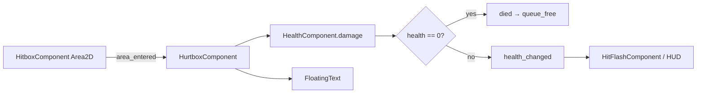

# Combat

Combat in Runebound uses **area-based hit detection** for player abilities and **body overlap** for enemy contact damage. Damage flows through `HealthComponent` on each entity.

## Damage Pipeline



### HitboxComponent

- `Area2D` on **physics layer 4** (EnemyCollision).
- Carries a `damage` float set by the spawning ability or weapon.
- Does not detect overlaps itself; enemies' hurtboxes listen for it.

### HurtboxComponent

- `Area2D` with `collision_mask = 4` (listens for hitboxes).
- On overlap with a `HitboxComponent`, applies damage to its exported `health_component`.
- Spawns `floating_text.tscn` on the `foreground_layer` showing damage dealt.

### HealthComponent

- Tracks `max_health` and `current_health`.
- `damage(amount)` clamps health to zero, emits `health_changed`, then deferred `check_death`.
- On death: emits `died` and `queue_free()` the owner.

## Player Damage Sources

### Contact damage (enemies)

The player (`player.gd`) uses `CollisionArea2D` with `collision_mask = 8` (layer 4) to detect overlapping enemy collision bodies:

- Counts overlapping bodies; when count > 0 and `DamageIntervalTimer` is idle, deals **1** damage and starts a **0.5s** cooldown.
- This is separate from the hitbox/hurtbox system — enemies damage the player through physics body overlap, not hurtboxes.

### Abilities

Abilities are **timer-driven controllers** under the player's `Abilities` node.

#### Sword (default)

`SwordAbilityController`:

1. On timer timeout, finds all nodes in group `enemy` within `MAX_RANGE` (200px).
2. Picks the closest enemy.
3. Spawns `sword_ability.tscn` at the enemy with a random offset, rotated toward the target.
4. Sets `hitbox_component.damage` (default **5**).

The sword scene plays a **swing** animation that briefly enables its hitbox collider (0.2–0.4s), then `queue_free`.

**Upgrade:** `sword_rate` (`resources/upgrades/sword_rate.tres`) reduces timer wait time by 10% per stack (max 5).

#### Axe (unlockable upgrade)

`AxeAbilityController`:

1. On timer timeout, spawns `axe_ability.tscn` at the player position.
2. Sets damage (default **10**).

The axe orbits outward from the player over 3 seconds (tween on `AxeAbility`), spinning via `AnimationPlayer`, then frees itself.

**Upgrade:** `axe` (`resources/upgrades/axe.tres`) — `Ability` resource that adds the controller scene to the player once (max quantity 1).

## Enemy Behavior

Both `basic_enemy` and `orc_enemy` share the same movement pattern:

```gdscript
velocity_component.accelerate_to_player()
velocity_component.move(self)
```

`VelocityComponent` lerps velocity toward the player at `max_speed` with configurable `acceleration`.

| Enemy | max_health | max_speed | notes |
|-------|------------|-----------|-------|
| Basic (slime) | 10 (default) | 40 (default) | 100% XP drop chance |
| Orc | 30 | 60 | Added to spawn table at arena difficulty 6 |

Enemies are `CharacterBody2D` on **layer 8** (Enemy), mask **9** (Terrain + EnemyCollision).

## Visual Feedback

### Hit flash

`HitFlashComponent` listens to `health_changed` and tweens a shader `lerp_percent` uniform from white flash back to normal over 0.25s. See [Components](components.md#hitflashcomponent).

### Floating damage numbers

`FloatingText` tweens upward with scale pulse, then frees itself.

## Weapon Scripts (Not in Main Loop)

Under `scripts/weapons/`, base classes support a mouse-aimed shooting model:

- `BaseWeapon` — rotates toward mouse, flips sprite Y, fires on `shoot` input.
- `RangedBaseWeapon` / `wand.gd` — instantiates bullet from `scenes/ammo.tscn` at a `ShootingPoint` marker.
- `MeleeBaseWeapon` — stub `_action()`.

These are **not** attached to the current `player.tscn`. The survivor-style auto-abilities are the active combat system.
