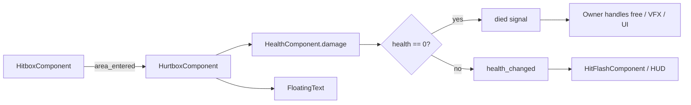

# Combat

Combat uses a **single team-aware hitbox/hurtbox pipeline**. Player abilities and enemy contact damage both flow through `HitboxComponent` → `HurtboxComponent` → `HealthComponent`.

## Damage Pipeline



### Teams and layers

| Source | Hitbox team / layer | Targets hurtbox team / mask |
|--------|---------------------|-----------------------------|
| Player abilities | `PLAYER` / PlayerHitbox | Enemy hurtboxes |
| Enemy contact | `ENEMY` / EnemyHitbox | Player hurtbox |

`HurtboxComponent` also checks `HitboxComponent.team` so mismatched overlaps are ignored.

### HitboxComponent

- Carries `damage` and `team`.
- Sets collision layer from team in `_ready`.
- `monitorable = true`, `monitoring = false` (hurtboxes detect hitboxes).

### HurtboxComponent

- Exports `health_component`, `team`, and `invulnerability_time`.
- Player hurtbox uses `invulnerability_time = 0.5`.
- On invulnerability end, re-checks `get_overlapping_areas()` so contact damage continues while overlapping.

### HealthComponent

- Tracks `max_health` and `current_health`.
- On zero health: emits `died` only — **does not** `queue_free` the owner.
- Owners (`BaseEnemy`, `RunManager` via player) decide what happens next.

## Player Damage

The player has a real `HurtboxComponent` (team `PLAYER`). Enemy contact `HitboxComponent`s deal damage from each enemy's `StatNames.DAMAGE` (slime 1, orc 2). There is no separate body-overlap damage path.

## Abilities

Abilities extend `BaseAbilityController` (`scripts/systems/base_ability_controller.gd`):

- Cooldown = `base_cooldown / stats.get_stat(ATTACK_RATE)`
- Damage = `base_damage * stats.get_stat(DAMAGE)`
- Targeting helpers live in `scripts/systems/targeting.gd`

### Sword (default)

- `base_cooldown = 1.0`, `base_damage = 5`, range 200.
- Spawns `sword_ability.tscn` at the nearest enemy; animation enables the hitbox briefly.

### Axe (unlockable `Ability`)

- `base_cooldown = 3.0`, `base_damage = 10`.
- Orbits the player for 3 seconds then frees itself.

## Enemy Behavior

Both slime and orc use `BaseEnemy` (`scripts/entities/base_enemy.gd`):

```gdscript
velocity_component.accelerate_to_player()
velocity_component.move(self)
```

Stats are applied from each scene's `EntityStats` resource in `_ready`. Movement runs in `_physics_process`.

| Enemy | Stats resource | Notes |
|-------|----------------|-------|
| Slime | `resources/stats/slime_stats.tres` | 100% XP drop chance |
| Orc | `resources/stats/orc_stats.tres` | Added at arena difficulty 6 |

## Visual Feedback

### Hit flash

`HitFlashComponent` listens to `health_changed` and tweens shader `lerp_percent` from white flash to normal over 0.25s. Script: `scenes/components/hit_flash_component.gd`.

### Floating damage numbers

`FloatingText` tweens upward with a scale pulse, then frees itself.
