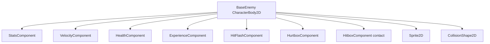

# Components

Reusable scenes under `scenes/components/` compose enemies and the player. Exports should prefer typed `class_name` references (`HealthComponent`, `StatsComponent`, etc.).

## Component Composition

A fully equipped enemy stacks:

The player uses `StatsComponent`, `HealthComponent`, and `HurtboxComponent` (no enemy-style contact hitbox).

---

## StatsComponent

**Script:** `scenes/components/stats_component.gd`  
**Class:** `StatsComponent`  
**Scene:** `scenes/components/stats_component.tscn`

| Export / API | Description |
|--------------|-------------|
| `base_stats` | `EntityStats` resource |
| `get_stat(name)` | `(base + flat) * (1 + percent)` |
| `add_modifier` / `set_modifier` / `remove_modifier` | Modifier stack keyed by source id |
| `stat_changed(stat_name)` | Signal when a resolved stat may have changed |

Stat name constants: `scripts/constants/stats.gd` (`StatNames.MAX_HEALTH`, `StatNames.MOVE_SPEED`, …).

Entity definitions: `resources/stats/player_stats.tres`, `slime_stats.tres`, `orc_stats.tres`.

---

## HealthComponent

**Script:** `scenes/components/health_component.gd`  
**Class:** `HealthComponent`

| Export / property | Description |
|-------------------|-------------|
| `max_health` | Starting and maximum HP |
| `current_health` | Runtime value, initialized in `_ready` |

**Signals:** `died`, `health_changed`

On zero health, emits `died` only. The owner frees itself (enemies) or is handled by `RunManager` (player).

---

## HitboxComponent

**Script:** `scenes/components/hitbox_component.gd`  
**Class:** `HitboxComponent`

| Property | Description |
|----------|-------------|
| `team` | `PLAYER` or `ENEMY` — sets collision layer |
| `damage` | Set from stats or abilities |

---

## HurtboxComponent

**Script:** `scenes/components/hurtbox_component.gd`  
**Class:** `HurtboxComponent`

| Export | Description |
|--------|-------------|
| `health_component` | Target to damage |
| `team` | Sets layer/mask pair |
| `invulnerability_time` | I-frames after a hit (0.5s on player) |

Spawns floating damage text on hit.

---

## VelocityComponent

**Script:** `scenes/components/velocity_component.gd`  
**Class:** `VelocityComponent`

| Export | Default | Description |
|--------|---------|-------------|
| `max_speed` | 40 | Top movement speed |
| `acceleration` | 5 | Lerp factor toward desired velocity |

**Methods:** `accelerate_to_player()`, `accelerate_in_direction(direction)`, `move(character_body)`.

Used by `BaseEnemy`. The player applies move speed from `StatsComponent` inline.

---

## ExperienceComponent

**Script:** `scenes/components/experience_component.gd`  
**Class:** `ExperienceComponent`

| Export | Description |
|--------|-------------|
| `drop_percent` | 0–1 chance to drop XP on death |
| `health_component` | Subscribes to `died` |
| `experience_scene` | Prefab (`experience.tscn`) |

---

## HitFlashComponent

**Script:** `scenes/components/hit_flash_component.gd`  
**Class:** `HitFlashComponent`  
**Scene:** `scenes/components/hit_flash_component.tscn`  
**Shader:** `scenes/components/hit_flash_component.gdshader`

| Export | Description |
|--------|-------------|
| `health_component` | Listens to `health_changed` |
| `sprite` | `Sprite2D` receiving the material |
| `hit_flash_material` | `ShaderMaterial` with `lerp_percent` |

Enemy scenes typically use a `resource_local_to_scene` material so concurrent flashes do not share uniform state. A shared default material also exists at `hit_flash_component_material.tres`.

---

## DeathComponent

**Scene:** `scenes/components/death_component.tscn`

GPU particle burst prefab. Available for owners to spawn on `died`; not auto-attached yet.

---

## Scene Instance Paths

| Component | Path |
|-----------|------|
| StatsComponent | `scenes/components/stats_component.tscn` |
| HealthComponent | `scenes/components/health_component.tscn` |
| HitboxComponent | `scenes/components/hitbox_component.tscn` |
| HurtboxComponent | `scenes/components/hurtbox_component.tscn` |
| VelocityComponent | `scenes/components/velocity_component.tscn` |
| ExperienceComponent | `scenes/components/experience_component.tscn` |
| HitFlashComponent | `scenes/components/hit_flash_component.tscn` |

When adding a new enemy: instance `basic_enemy.tscn` as a template, point `StatsComponent.base_stats` at a new `.tres`, and keep the script as `BaseEnemy`.
