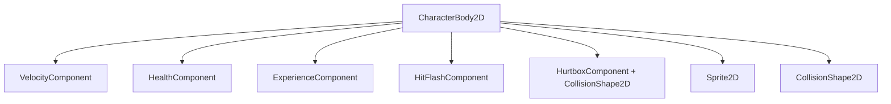

# Components

Reusable scenes under `scenes/components/` compose enemies and the player. Each component is a small, focused `Node` or `Area2D` child with an exported reference to siblings (typically `HealthComponent`).

## Component Composition

A fully equipped enemy (e.g. `basic_enemy.tscn`) stacks:



The player uses `HealthComponent` only (no hurtbox — damage comes from contact overlap).

---

## HealthComponent

**Script:** `scenes/components/health_component.gd`  
**Class:** `HealthComponent`

| Export / property | Description |
|-------------------|-------------|
| `max_health` | Starting and maximum HP |
| `current_health` | Runtime value, initialized in `_ready` |

**Signals:** `died`, `health_changed`

On zero health, emits `died` and frees the owner. Other components subscribe to these signals rather than polling.

---

## HitboxComponent

**Script:** `scenes/components/hitbox_component.gd`  
**Class:** `HitboxComponent`

| Property | Description |
|----------|-------------|
| `damage` | Set at spawn time by abilities |

Physics: **layer 4**, mask 0. Paired with `HurtboxComponent` on enemies.

---

## HurtboxComponent

**Script:** `scenes/components/hurtbox_component.gd`  
**Class:** `HurtboxComponent`

| Export | Description |
|--------|-------------|
| `health_component` | Target to damage |

Physics: **mask 4** (detects hitboxes). Also in group `enemy` (used by sword targeting).

Spawns floating damage text on hit.

---

## VelocityComponent

**Script:** `scenes/components/velocity_component.gd`

| Export | Default | Description |
|--------|---------|-------------|
| `max_speed` | 40 | Top movement speed |
| `acceleration` | 5 | Lerp factor toward desired velocity |

**Methods:**

- `accelerate_to_player()` — direction toward `player` group node.
- `accelerate_in_direction(direction)` — generic chase / patrol helper.
- `move(character_body)` — applies velocity and `move_and_slide()`.

Used by enemy scripts, not the player (player handles movement inline in `player.gd`).

---

## ExperienceComponent

**Script:** `scenes/components/experience_component.gd`

| Export | Description |
|--------|-------------|
| `drop_percent` | 0–1 chance to drop XP on death (default 0.75) |
| `health_component` | Subscribes to `died` |
| `experience_scene` | Prefab (`experience.tscn`) |

On death, may spawn an experience orb at the owner's position on `entities_layer`.

---

## HitFlashComponent

**Script:** `hit_flash_component.gd` (project root)  
**Scene:** `scenes/components/hit_flash_component.tscn`  
**Shader:** `scenes/components/hit_flash_component.gdshader`  
**Material:** `scenes/components/hit_flash_component_material.tres`

Recent work added white-flash feedback when an entity takes damage.

| Export | Description |
|--------|-------------|
| `health_component` | Listens to `health_changed` |
| `sprite` | `Sprite2D` to receive the shader material |
| `hit_flash_material` | `ShaderMaterial` with `lerp_percent` uniform |

**Behavior:**

1. On `_ready`, assigns `hit_flash_material` to the sprite.
2. On `health_changed`, kills any active tween, sets `lerp_percent` to `1.0` (full white mix).
3. Tweens `lerp_percent` back to `0.0` over **0.25s** (cubic ease-in).

**Shader logic:** mixes texture color toward white by `lerp_percent`:

```glsl
vec4 final_color = mix(texture_color, vec4(1.0, 1.0, 1.0, texture_color.a), lerp_percent);
```

`basic_enemy.tscn` uses the shared material resource; `orc_enemy.tscn` embeds a local `ShaderMaterial` sub-resource with the same shader.

---

## DeathComponent

**Scene:** `scenes/components/death_component.tscn`

Contains a `GPUParticles2D` with a slime texture. **Not currently instanced** on enemy death — available for future death VFX.

---

## Scene Instance Paths

| Component | Scene UID path |
|-----------|----------------|
| HealthComponent | `scenes/components/health_component.tscn` |
| HitboxComponent | `scenes/components/hitbox_component.tscn` |
| HurtboxComponent | `scenes/components/hurtbox_component.tscn` |
| VelocityComponent | `scenes/components/velocity_component.tscn` |
| ExperienceComponent | `scenes/components/experience_component.tscn` |
| HitFlashComponent | `scenes/components/hit_flash_component.tscn` |

When adding a new enemy, duplicate the component wiring from `basic_enemy.tscn` and adjust `HealthComponent`, `VelocityComponent`, and collision shapes as needed.
