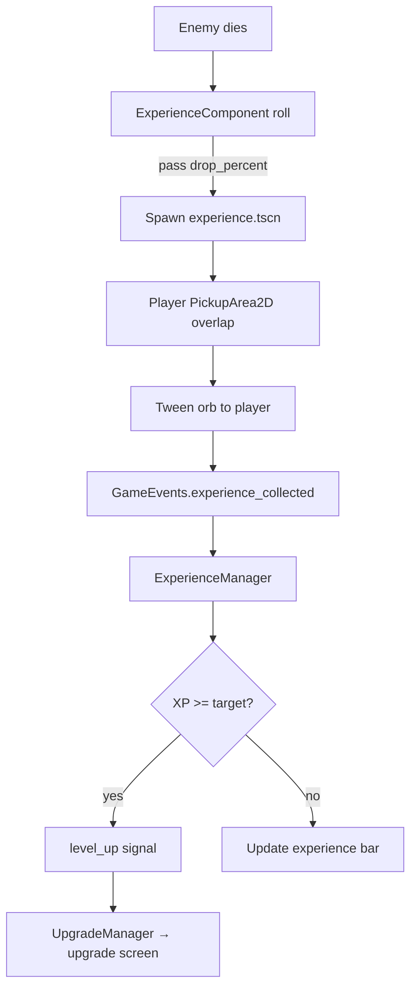

# Progression

Progression combines **experience orbs**, **level-ups with roguelike upgrades**, and **escalating arena difficulty** over a timed run.

## Experience Loop



### Experience pickup

`scenes/game_object/experience/experience.gd`:

- `Area2D` detects player pickup area.
- Disables collision, tweens position toward player over 0.5s, shrinks sprite, then calls `GameEvents.emit_experience_collected(1)`.

### ExperienceManager

| Property | Initial | Notes |
|----------|---------|-------|
| `current_experience` | 0 | Clamped to `target_experience` per level |
| `current_level` | 1 | Incremented on each level-up |
| `target_experience` | 5 | Grows by `TARGET_EXPERIENCE_GROWTH` (5) each level |

Signals:

- `experience_updated(current, target)` → `ExperienceBar` HUD
- `level_up(new_level)` → `UpgradeManager`

## Upgrade System

### Resources

Defined in `resources/upgrades/`:

| File | Class | id | max_quantity | Effect |
|------|-------|-----|--------------|--------|
| `sword_rate.tres` | `AbilityUpgrade` | `sword_rate` | 5 | −10% sword timer per stack |
| `axe.tres` | `Ability` | `axe` | 1 | Adds `AxeAbilityController` to player |

`Ability` extends `AbilityUpgrade` with an extra `ability_controller_scene` export.

### UpgradeManager flow

1. `experience_manager.level_up` triggers `on_level_up`.
2. Pauses the tree via `upgrade_screen.tscn` (`get_tree().paused = true`).
3. `pick_upgrades()` chooses **2** random distinct upgrades from `upgrade_pool`.
4. Player clicks a card → `apply_upgrade` → `GameEvents.emit_ability_upgrade_added`.
5. Screen unpauses and frees itself.

`current_upgrades` is a `Dictionary` keyed by upgrade `id`:

```gdscript
{ "id": { "resource": AbilityUpgrade, "quantity": int } }
```

When `quantity` reaches `max_quantity`, that upgrade is filtered out of future picks.

### Player ability wiring

`player.gd` listens to `GameEvents.ability_upgrade_added`:

- If the upgrade is an `Ability`, instantiates `ability_controller_scene` under `$Abilities`.
- Non-`Ability` upgrades (e.g. `sword_rate`) are handled by existing controllers listening to the same signal.

## Arena Difficulty

`ArenaTimeManager` drives time pressure and spawn escalation.

| Constant | Value |
|----------|-------|
| Arena duration | 300 seconds (5 minutes) |
| Difficulty tick interval | 5 seconds |

Each tick:

1. `arena_difficulty` increments.
2. `arena_difficulty_increased` is emitted.

### EnemyManager response

On `arena_difficulty_increased`:

- Spawn timer reduced: `time_off = min(0.1/12 * difficulty, 0.7)` seconds from base wait time.
- At **difficulty 6**: adds `orc_enemy_scene` to the weighted table (weight 20; basic enemy weight 10).

### UI

`ArenaTimeUI` displays elapsed time as `M:SS` from `arena_time_manager.get_time_elapsed()`.

## Run End Conditions

| Trigger | Handler | Screen |
|---------|---------|--------|
| Player `HealthComponent.died` | `main.gd` → `set_defeat()` | End screen: "Defeat" |
| Arena timer timeout | `arena_time_manager.gd` | End screen: default "Victory!" labels |

Both use `scenes/UI/end_screen.tscn` with restart (reload main) and quit buttons.

## WeightedTable Utility

`scripts/weighted_table.gd` — generic weighted random picker used by `EnemyManager`:

```gdscript
enemy_table.add_item(basic_enemy_scene, 10)
enemy_table.add_item(orc_enemy_scene, 20)  # after difficulty 6
var scene = enemy_table.pick_item()
```

Keeps spawn variety declarative without hard-coded random branches.
