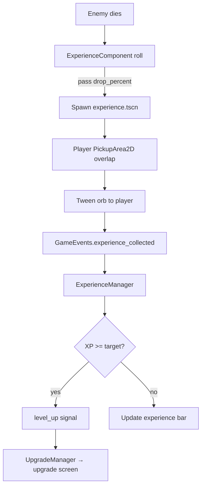

# Progression

Progression combines **experience orbs**, **level-ups with data-driven upgrades**, and **escalating arena difficulty** over a timed run owned by `RunManager`.

## Experience Loop

### ExperienceManager

| Property | Initial | Notes |
|----------|---------|-------|
| `current_experience` | 0 | Overflow carries across levels |
| `current_level` | 1 | Incremented on each level-up |
| `target_experience` | 5 | Grows by `TARGET_EXPERIENCE_GROWTH` (5) each level |

## Upgrade System

### Resource types

| Class | Role |
|-------|------|
| `AbilityUpgrade` | Base: `id`, `max_quantity`, `name`, `description` |
| `Ability` | Adds `ability_controller_scene` to the player once |
| `StatUpgrade` | Applies a flat/percent modifier to a named stat via `StatsComponent` |

### Pool (`resources/upgrades/`)

| File | Class | Effect |
|------|-------|--------|
| `sword_rate.tres` | `StatUpgrade` | +10% `attack_rate` per stack (max 5) |
| `move_speed.tres` | `StatUpgrade` | +15% `move_speed` per stack (max 5) |
| `max_health.tres` | `StatUpgrade` | +20% `max_health` per stack (max 5) |
| `axe.tres` | `Ability` | Adds `AxeAbilityController` (max 1) |

New stat upgrades are `.tres` files — no controller code changes required.

### Application

1. `UpgradeManager` tracks quantity and emits `GameEvents.ability_upgrade_added`.
2. Player handles:
   - `Ability` → instantiate controller under `$Abilities`.
   - `StatUpgrade` → `stats_component.set_modifier(id, stat, type, value_per_stack * quantity)`.
3. `BaseAbilityController` / player movement listen to `stat_changed` and re-read stats.

## Arena Difficulty

| Constant | Value |
|----------|-------|
| Arena duration | 300 seconds (5 minutes) |
| Difficulty tick interval | 5 seconds |

On each tick, `EnemyManager` shortens spawn interval and, at **difficulty 6**, adds the orc to the weighted table.

## Run End Conditions

Owned by `RunManager`:

| Trigger | Result |
|---------|--------|
| Player `HealthComponent.died` | End screen via `set_defeat()` |
| `ArenaTimeManager.run_time_expired` | End screen via `set_victory()` |

Both pause the tree. Restart unpauses and reloads `main.tscn`.

## WeightedTable Utility

`scripts/weighted_table.gd` — generic weighted random picker used by `EnemyManager`.
